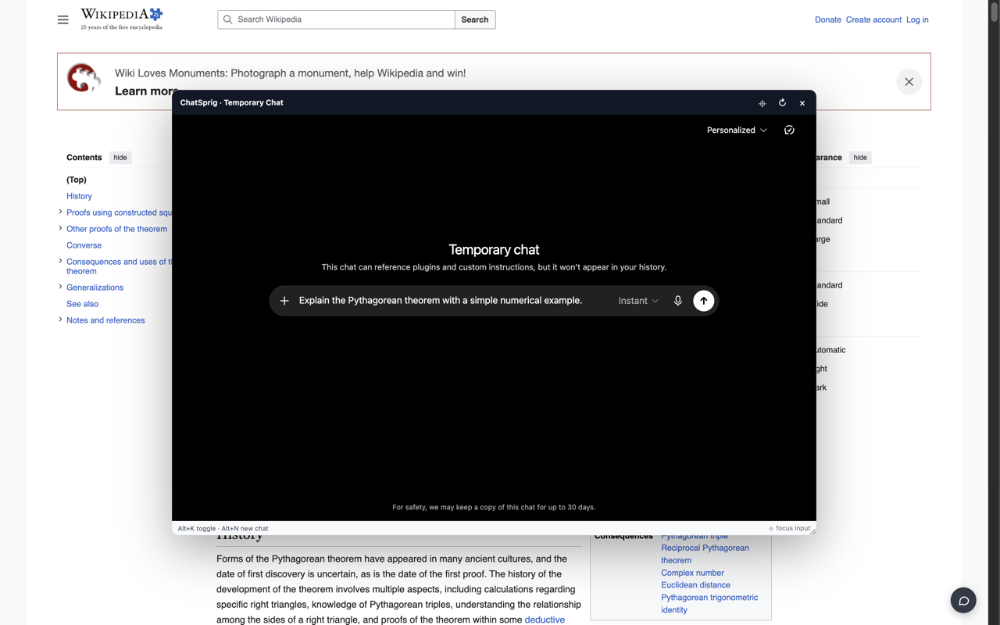

<div align="center">
  
  <h1>ChatSprig</h1>
  <p><strong>Ask here. Stay here.</strong></p>
  <p>Temporary ChatGPT and Gemini conversations, right on your page.</p>
  <p>
    <a href="https://chromewebstore.google.com/detail/chatsprig-%E2%80%94-temporary-cha/ecgdiaglcgfknjopckmjjcokanaldobe"></a>
    <a href="https://github.com/william1010121/chatsprig/stargazers"></a>
    
    
  </p>
  <p><a href="#meet-chatsprig">Features</a> · <a href="#get-started">Get started</a> · <a href="#keyboard-shortcuts">Shortcuts</a> · <a href="#privacy--permissions">Privacy</a></p>
</div>

---

## Meet ChatSprig

Reading an article. Working through a problem. A quick question comes to mind.
Open ChatSprig, ask ChatGPT, and return to what you were doing — all in the same page.

| A little less friction | What you get |
| --- | --- |
| **Chat where you are** | A centered, resizable ChatGPT or Gemini overlay on supported web pages. |
| **Start fresh** | Open a temporary chat, or reload the overlay for a new one. |
| **Keep your focus** | Hide the embedded sidebar and jump straight into the prompt. |
| **Reach it your way** | Keyboard shortcuts or a floating launcher in your preferred corner. |
| **Take the math with you** | Copy supported math on ChatGPT pages as LaTeX source. |
| **Make it yours** | Click the toolbar icon for settings that sync with Chrome. |

ChatSprig opens the ChatGPT and Gemini websites directly. On either service’s main page, select message text and choose **Ask in sidebar** to send just that selection to the matching floating chat. It does not send the surrounding conversation or page. You can also type or paste context yourself.



## Get started

**Chrome Web Store:** [install the current public release (2.1.1)](https://chromewebstore.google.com/detail/chatsprig-%E2%80%94-temporary-cha/ecgdiaglcgfknjopckmjjcokanaldobe). The `main` branch contains the upcoming 2.2.0 release with Gemini, Ask in sidebar, Compact view, and custom prompt support.

### Install from this repository

1. Clone or download this repository.
2. Open `chrome://extensions` and enable **Developer mode**.
3. Choose **Load unpacked** and select the project folder.
4. Refresh your web pages, then press **Alt+K** on Windows or **Option+K** on macOS.

Sign in to ChatGPT in a normal tab first if needed. ChatGPT account, usage, and plan restrictions still apply. Disable any older userscript version of this helper to avoid duplicate actions.

## Keyboard shortcuts

| Action | Windows / Linux | macOS |
| --- | --- | --- |
| Open / switch to ChatGPT | `Alt+K` | `Option+K` |
| Open / switch to Gemini | `Alt+G` | `Option+G` |
| Start a new temporary chat in the current service | `Alt+N` | `Option+N` |
| Open settings | Click the extension toolbar icon | Click the extension toolbar icon |

Change browser command assignments at `chrome://extensions/shortcuts`.
The fixed Alt/Option+K, Alt/Option+G, and Alt/Option+N page shortcuts also work as a fallback, including inside the embedded prompt. They remain active even if browser commands are remapped and require focus inside a web page.

## Your workspace, your settings

- Choose the overlay size and launcher corner.
- Hide the sidebar inside either service’s overlay.
- Focus the prompt automatically when opening.
- Choose whether the toggle shortcut closes the overlay or focuses it.
- Show or hide the launcher, including specifically on ChatGPT websites.
- Enable LaTeX copying and configure cross-site sign-in compatibility.
- Toggle **Compact view** with the control at the bottom of ChatGPT’s model picker in both Chat and Work. It joins adjacent text paragraphs for reading and uses comfortable paragraph/list spacing, 1.65 line height, and 12% side margins. The choice syncs across tabs and also applies inside the overlay; turning it off restores ChatGPT’s layout.

### Gemini and switching services

Press **Alt+G** (Option+G on macOS) to open Gemini. **Alt+K** switches to ChatGPT. Only one service is visible per page; switching or closing keeps each loaded frame, conversation, and draft. **Alt+N** replaces only the current service with a fresh temporary chat, even when the overlay is closed. Before either service has been used, Alt+N defaults to ChatGPT. Reloading the host page restores the open service with a new temporary conversation.

The two launcher buttons overlap in the selected corner. Hover or focus them with the keyboard to expand inward, then choose ChatGPT or Gemini. The existing “Hide launcher on ChatGPT” setting applies only to ChatGPT websites.

Gemini loads `/app`, activates Temporary chat, and verifies that mode before exposing the input. If initialization or embedded sign-in fails, the overlay shows a retry message; it does not silently use an ordinary conversation. Sign in at gemini.google.com in a regular tab first. Google cookies are not rewritten. Browser restrictions can still prevent embedded sign-in. Switching back preserves the existing temporary chat; reloading creates a new one.

In Settings, **Default Gemini model** selects Flash-Lite, Flash, or Pro for new temporary chats. The default leaves Gemini’s current choice unchanged. Switching back to an existing conversation does not change its model. If a requested model is unavailable or cannot be verified, initialization reports an error instead of silently using another model.

Gemini supports the overlay and Ask in sidebar. LaTeX copying and Compact view remain ChatGPT-only.

### Ask in sidebar

On Gemini, select message text and click **Ask in sidebar** beside the selection to open the Gemini overlay. Only plain selected text is passed.

On ChatGPT, select message text, then click **Ask in sidebar** beside the native **Ask ChatGPT / Share highlighted** actions. The existing floating chat opens without reloading or starting a new conversation.

- **Auto-send** is available in Settings → Ask in sidebar and is on by default. Turn it off to fill the prompt and add your own question before sending. The preference is shared by both services and syncs across tabs.
- **Append system prompt** is the document-plus icon beside Compact view at the bottom of the model picker. It is shown only when ChatGPT **Chat** mode is explicitly identified; Work, Gemini and unrecognized modes never append instructions. The switch is off by default. Edit the text and **Repeat every k user messages** in Settings → System prompt: `0` (default) means first message only, `1` means every message, and `3` means messages 1, 4, 7, 10… The current conversation branch determines the count; AI responses and regenerations do not count. Changing k recalculates from the start, and a new conversation starts over. Manual sends and Ask in sidebar follow the same rule. Unknown or incomplete history skips appending. Existing conversations without a Chat/Work switch are identified when their model menu is opened; verified mode is remembered per conversation in that tab across reloads. Without positive mode evidence, appending stays disabled. Empty text adds nothing; the instructions are ordinary message text, not an API system role.
- When **Copy LaTeX** is enabled, selected formulas use the same LaTeX conversion as copying, including inline `\(...\)` and display `\[...\]` delimiters. Disabling Copy LaTeX keeps plain selected text.
- Existing drafts are preserved; the selection is appended after a blank line and waits for review. If the sidebar is generating, the selection stays in the input and is not automatically sent later.
- Selecting text alone never sends anything. This action is available on the main ChatGPT and Gemini pages, not inside the floating chat. Each selection goes to its source service.
- The floating chat footer reports filling or delivery problems. Check its draft before retrying. Closing, switching services, or refreshing the floating chat cancels pending work.

The main ChatGPT website keeps its own sidebar. The sidebar preference applies only to ChatSprig's embedded chat.

## Privacy & permissions

**No developer-operated analytics, advertising, or conversation backend.** Settings are stored through Chrome Sync. Chat messages go directly to the selected service and are subject to OpenAI’s or Google’s terms and privacy practices.

| Access | Purpose |
| --- | --- |
| Web-page content scripts | Display the launcher, handle shortcuts, and host the overlay. On ChatGPT, also focus the prompt, hide the embedded sidebar, and convert selected math when copying. |
| Storage | Save and sync preferences. |
| ChatGPT cookies | Support cross-site sign-in when cookie rewriting is enabled. |
| Declarative network rules with host access | Remove frame-blocking response headers from ChatGPT subframes and X-Frame-Options from Gemini subframes, limited to granted host access. |

Tab routing uses tab IDs and messaging without requesting the `tabs` or `activeTab` permission.

### Cross-site sign-in compatibility

Cookie rewriting is **enabled by default**. It changes eligible ChatGPT cookies to `SameSite=None; Secure`, including session cookies, in the browser's cookie store. This weakens SameSite-based cross-site request forgery protection and can affect ChatGPT outside the overlay. The extension does not send those cookie values to its developer.

Turning this setting off stops future rewrites; **it does not restore cookies already changed**. ChatGPT may replace them during subsequent account activity. Chrome's third-party-cookie restrictions can still prevent sign-in inside other websites.

Read the [privacy policy](PRIVACY.md) for details.

## Know the limits

- Chrome internal pages, the Web Store, some PDF viewers, and restricted pages cannot host the overlay. Failed shortcuts show a `!` badge; ChatSprig does not open a fallback ChatGPT tab or window.
- The embedded frame blocks popups and top-level navigation. Sign-in flows or links requiring a separate window may not work.
- Website security rules, browser cookie policies, and changes to ChatGPT can affect embedding.
- Temporary chats follow ChatGPT's own retention rules; “temporary” does not mean that OpenAI retains no data.
- Windows keyboard behavior is covered by automated tests; the current browser layout was verified on macOS. Linux has not been manually verified.

## Development

Plain JavaScript. Manifest V3. No runtime framework or build step.

```bash
# Run regression checks (Node.js)
node --test tests/*.test.mjs

# Regenerate icon sizes from the approved artwork (macOS)
python3 scripts/make_icons.py

# Create a clean Chrome Web Store upload
python3 scripts/package_extension.py
```

<details>
<summary><strong>Project map</strong></summary>

```text
background.js       Commands, tab routing, settings, cookie compatibility
content/            Overlay, launcher, keyboard handling, LaTeX copying
shared/             Shared settings defaults
options/            Settings page
icons/              Packaged extension icons
assets/branding/    Approved GPT Image artwork and generation prompts
store/              Listing copy, review notes, and promotional assets
scripts/            Icon export and release packaging
```

</details>

## Support and license

Report bugs or suggest improvements in [GitHub Issues](https://github.com/william1010121/chatsprig/issues). ChatSprig is available under the [MIT License](LICENSE).

---

<div align="center">
  <p><strong>A little chat. Keep your flow.</strong></p>
  <p>If ChatSprig helps you, <a href="https://github.com/william1010121/chatsprig/stargazers">give it a star ★</a>.</p>
  <p><sub>Independent project. Not affiliated with or endorsed by OpenAI or Google. ChatGPT is an OpenAI product.</sub></p>
</div>
